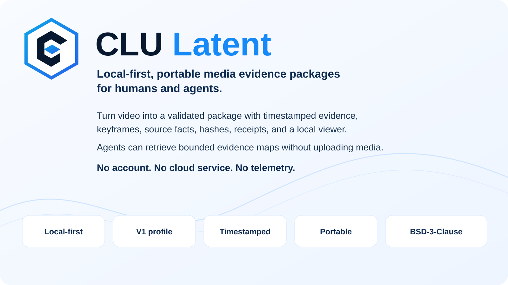
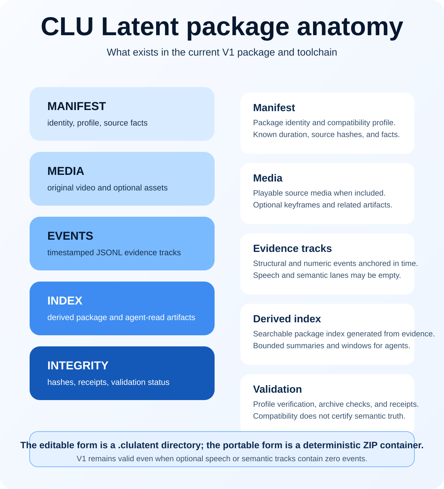
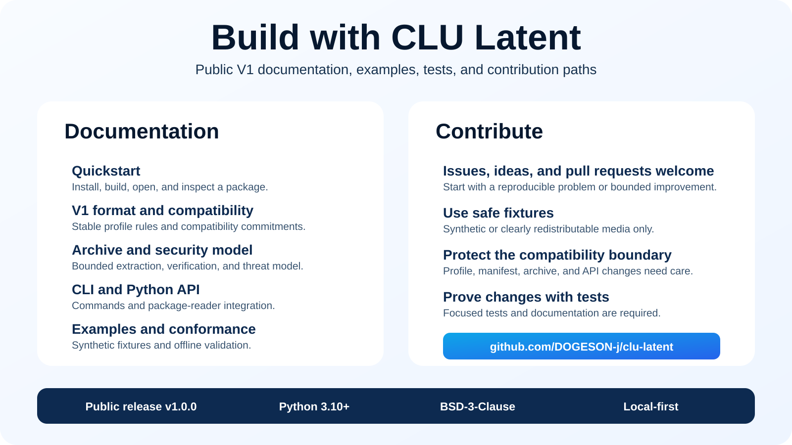

# CLULatent

<p align="center">
  
</p>

CLULatent turns video and media into a validated, timestamped, reviewable
evidence package that humans can play and software agents can inspect through
bounded evidence windows, references, caveats, and retrieval hooks.

> MP4 plays media. CLULatent plays media plus evidence.

CLULatent V1 is the first public compatibility profile and reference
implementation. It is local-first: no account, cloud service, analytics,
telemetry, or model API is required.

V1 is a stable format profile. Some advanced implementation APIs remain
experimental and are covered by the compatibility policy.

## Install

Recommended CLI installation:

```bash
pipx install clu-latent
```

Alternatives:

```bash
uv tool install clu-latent
python -m pip install clu-latent
uvx clu-latent --help
```

Before or without PyPI:

```bash
python -m pip install "clu-latent @ git+https://github.com/DOGESON-j/clu-latent@v1.0.0"
```

FFmpeg and ffprobe are system tools, not Python dependencies. They are required
for media build operations and detected by `clulatent doctor`.

## First run

```bash
clulatent build-video demo.mp4 -o demo.clulatent --profile v1
clulatent open demo.clulatent
```

Or try the bundled synthetic fixture without network access:

```bash
clulatent demo --no-browser
```

For a source checkout:

```bash
python -m pip install -e ".[dev]"
python -m pytest
```

## What a package contains

<p align="center">
  
</p>

A package records a manifest and source hash facts, timestamped JSONL evidence
tracks, receipts, a derived search index, optional keyframes, package-index and
agent-read artifacts, validation status, and lock information.

The editable form is a directory named `PACKAGE.clulatent/`. The portable
transport form is a deterministic ZIP container named `PACKAGE.clulatent`.
The future `.clubin` compiled form is not built and is not part of V1.

## Human playback viewer

`clulatent open PACKAGE` generates a self-contained local HTML viewer with
package facts, playable media when available, an evidence timeline, track
toggles, bounded event details, keyframes, V1 profile/index status, and visible
caveats. It uses no CDN, remote font, analytics, or external script.

This viewer displays package facts and timestamped evidence. It does not
certify scene meaning.

## Agent-read perception pyramid

Agents can start cheaply and retrieve focused evidence only when needed:

```bash
clulatent agent-read summary demo.clulatent
clulatent agent-read window demo.clulatent --time 17s
clulatent ask demo.clulatent "What evidence exists around 17s?"
```

These commands produce bounded evidence maps and handoff prompts. They do not
call a model or answer the question themselves.

## V1 profile and conformance

The public profile identifier is `clulatent.profile.v1`; the format contract
version is `1.0`.

```bash
clulatent profile inspect v1
clulatent profile verify PACKAGE
clulatent conformance run
```

CLULatent V1 compatibility certifies package/profile compatibility, not
semantic truth about media content.

## Portable archive

```bash
clulatent pack PACKAGE.clulatent/ -o PACKAGE.clulatent
clulatent archive verify PACKAGE.clulatent
clulatent unpack PACKAGE.clulatent -o PACKAGE-copy.clulatent/
```

Archive extraction rejects traversal, absolute and drive paths, links and
special files, duplicate/conflicting members, nested archives, suspicious
compression ratios, and bounded resource-limit violations.

## Python API

```python
from clu_latent import open_package

with open_package("demo.clulatent") as package:
    print(package.package_id)
    print(package.list_tracks())
```

The V1 format/profile identifiers are compatibility commitments. Public Python
APIs follow semantic versioning; undocumented internals remain provisional.

## Safety boundary

CLULatent V1 is a package format, reference Python implementation, CLI,
reader/parser, validator, local viewer, agent-read map generator, and portable
evidence container. It supplies evidence, not truth; user judgment and source
review are still required.

CLULatent does not understand video. It is not general video understanding,
object/face/identity/emotion/intent
recognition, guaranteed transcription truth, semantic certification of a
scene, a replacement for human review, or `.clubin`.

Evidence lanes are primarily structural and numeric. Some processing requires
FFmpeg installed separately. The viewer is local/static rather than a cloud
collaboration product: there is no cloud service, no Studio UI, and no ML is
required for the bundled demo. Public interoperability is new and needs
external feedback.

CLULatent is distributed under the BSD 3-Clause license.

## Documentation

<p align="center">
  
</p>

- [Quickstart](docs/QUICKSTART.md)
- [V1 format](docs/FORMAT_V1.md)
- [Archive format and limits](docs/ARCHIVE_V1.md)
- [Security model](docs/SECURITY_MODEL.md)
- [Conformance](docs/CONFORMANCE.md)
- [Compatibility](docs/COMPATIBILITY.md)
- [CLI reference](docs/CLI_REFERENCE.md)
- [Python API](docs/PYTHON_API.md)

See [CONTRIBUTING.md](CONTRIBUTING.md), [SECURITY.md](SECURITY.md),
[SUPPORT.md](SUPPORT.md), and [LICENSE](LICENSE).
